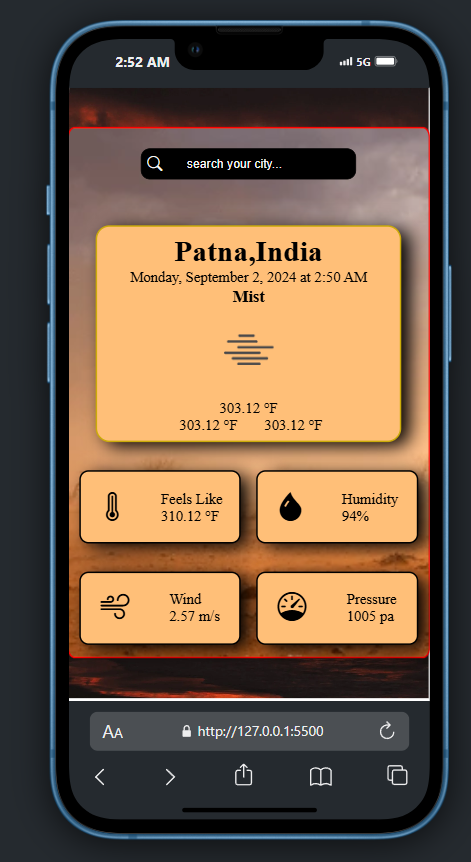

<h1 align="center">Weather Application</h1>

Weather Appplication web application with HTML, CSS and JavaScript

## Table of Contents
* [Project Purpose](#project-purpose)
* [Technologies](#technologies)
* [Quick Tour](#quick-tour)
* [How to run the app](#how-to-run-the-app)

## Project Purpose
The purpose of this weather application project is to provide users with real-time weather information for any location they are interested in. By using the OpenWeather API, this application allows users to search for and view current weather conditions, including temperature, weather descriptions, humidity, and wind speed, for specific cities around the world. This project demonstrates my ability to integrate third-party APIs, manipulate data dynamically with JavaScript, and create a user-friendly interface using HTML and CSS. It also showcases how client-side technologies can be used to build practical and interactive web applications. Additionally, I gained exposure to using the fetch method in JavaScript to handle asynchronous API requests efficiently.

## Technologies
* HTML5
* CSS3
* ECMAScript 2023
* OpenWeather API

## Quick Tour
<h2 align="center">Home Page</h2>

    

<h2 align="center">Weather Details</h2>

    

<h2 align="center">Weather Details</h2>

    

<h2 align="center">Anderoid Responsiveness</h2>

    
    

<h2 align="center">IOS Responsiveness</h2>

    

<h2 align="center">Tabs Responsiveness</h2>

    

## How to run the app
1. Download the code
2. Install live server if you don't have
3. Run the server

